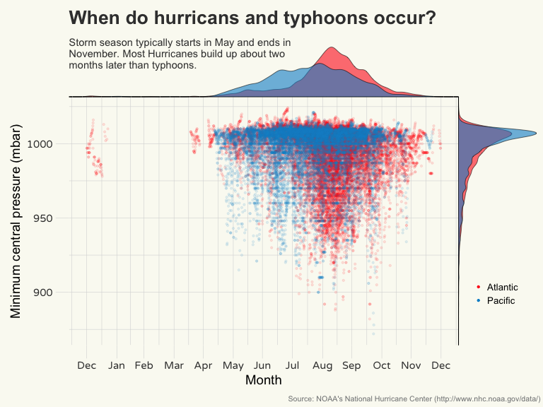

# Storm data exploration (3/n)


## Loading the environment

Loading the workspace that has been saved in the first part of the data exploration.

```r
# Entire workspace.
source_data("https://github.com/thomassie/Storms/blob/master/Exploration/StormDataWorkSpace.RData?raw=true")
```

```
##  [1] "plot.pressure.dens.x" "theme_tmm538"         "dd.i"                
##  [4] "plot.pressure.1"      "plot.pressure.dens.y" "dd.sum.year"         
##  [7] "plot.pressure.2"      "plot.wind.main"       "year.max"            
## [10] "topn.WindKPH.Max"     "plot.wind.1"          "pal_tmm_01"          
## [13] "plot.wind.2"          "plot.dur"             "plot.pres"           
## [16] ".Random.seed"         "topn.Duration"        "plot.pressure.main"  
## [19] "topn.Pressure.Min"    "w.max"                "dd.model.1"          
## [22] "model.1"              "rho.wind.pres"        "n.select"            
## [25] "dd"                   "p.min"                "year.min"            
## [28] "i"                    "dd.pacific"           "plot.wind"           
## [31] "n"                    "d.max"                "plot.wind.dens.x"    
## [34] "dd.model.temp.1"      "plot.wind.dens.y"     "dd.atlantic"         
## [37] "dd.sum"               "dd.org"
```


When do the storms typicall occur during a year?

```r
plot.pressure.year.main <- ggplot(data = dd,
                                  aes(x = DateTimeSameYear,
                                      y = Pressure)) + 
  geom_point(aes(colour = Ocean),
             size = 0.8,
             alpha = 0.1) +
  # geom_smooth(method = "lm",
  #             color = "#333333") +
  labs(x = "Month", 
       y = "Minimum central pressure (mbar)",
       title = "When do hurricans and typhoons occur?",
       subtitle = expression("Storm season typically starts in May and ends in \nNovember. Most Hurricanes build up about two \nmonths later than typhoons."),
       caption = "Source: NOAA's National Hurricane Center (http://www.nhc.noaa.gov/data/)") +
  theme(axis.text = element_text(family = "Varela Round"),
        axis.text.x = element_text(size = 11, colour = "#3C3C3C", face = "bold", vjust = 1),
        axis.text.y = element_text(size = 11, colour = "#3C3C3C", face = "bold", vjust = 0.5),
        axis.ticks = element_line(colour = "#D7D8D8", size = 0.2),
        axis.ticks.length = unit(5, "mm"),
        axis.line = element_blank(),
        plot.title = element_text(face = "bold", hjust = 0, vjust = -0.5, colour = "#3C3C3C", size = 20),
        plot.subtitle = element_text(hjust = 0, vjust = -12, colour = "#3C3C3C", size = 11),
        plot.caption = element_text(size = 8, hjust = 1.6, vjust = -0.1, colour = "#7F8182"),
        panel.background = element_rect(fill = "#FAFAF2"),
        panel.border = element_blank(),
        plot.background = element_rect(fill = "#FAFAF2", colour = "#FAFAF2"),
        panel.grid.major = element_line(colour = "#D7D8D8", size = 0.2),
        panel.grid.minor = element_line(colour = "#D7D8D8", size = 0.2)) +
  theme(legend.title = element_blank(),
        legend.justification=c(0,1),
        legend.position=c(1.02, 0.3),
        legend.background = element_blank(),
        legend.key = element_blank(),
        legend.text = element_text(size = 10)) +
  scale_colour_manual(values = c("#FF281E", "#0090CF")) +
  # rremove("legend") +
  scale_x_datetime(labels = date_format("%b"),
                   date_breaks = "month",
                   limits = c(min(dd$DateTimeSameYear), max(dd$DateTimeSameYear))) +
  guides(colour = guide_legend(override.aes = list(alpha = 1)))

plot.pressure.year.dens.x <- axis_canvas(plot.pressure.year.main, axis = "x") + 
  geom_density(data = dd, aes(x = as.numeric(DateTimeSameYear), fill = Ocean),
               alpha = 0.6, size = 0.2) +
  scale_fill_manual(values = c("#FF281E", "#0090CF"))

# ...and one on the right site.
plot.pressure.year.dens.y <- axis_canvas(plot.pressure.year.main, axis = "y", coord_flip = TRUE) +
  geom_density(data = dd, aes(x = as.numeric(Pressure), fill = Ocean),
               alpha = 0.6, size = 0.2) +
  scale_fill_manual(values = c("#FF281E", "#0090CF")) +
  coord_flip()
```


```r
plot.pressure.year.1 <- insert_xaxis_grob(plot.pressure.year.main, 
                                          plot.pressure.year.dens.x, 
                                          grid::unit(0.2, "null"), 
                                          position = "top")
plot.pressure.year.2 <- insert_yaxis_grob(plot.pressure.year.1, 
                                          plot.pressure.year.dens.y, 
                                          grid::unit(.2, "null"), 
                                          position = "right")
ggdraw(plot.pressure.year.2)
```

<!-- -->


When do the storms typicall occur during a year?


<!-- -->


After what time do storms typically reach their maximum intensity?


<!-- -->


However, the time at which a storm reaches its maximum intensity has to be related to its total duration.


<!-- -->


Next, one can ask for the regions that are most storm prone.

```r
plot.pressure.main <- ggplot(data = dd,
                             aes(x = Lon -360,
                                 y = Lat)) +
  stat_density_2d(geom = "raster",
                  aes(fill = ..density..),
                  contour = FALSE,
                  alpha = 0.9,
                  show.legend = FALSE)
# scale_fill_gradientn(colours = rev( brewer.pal( 9, "Blues" ))) +
```


