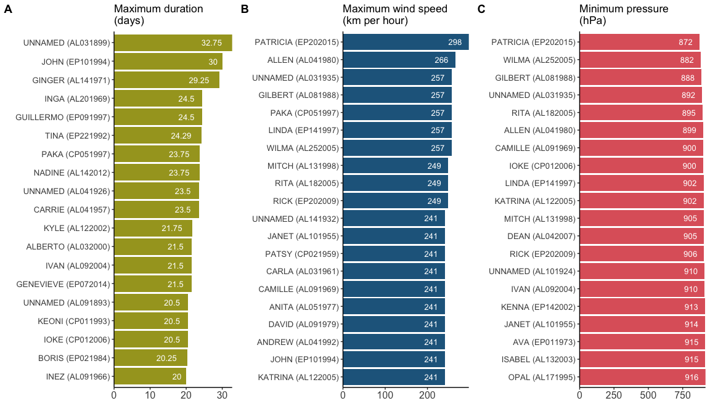
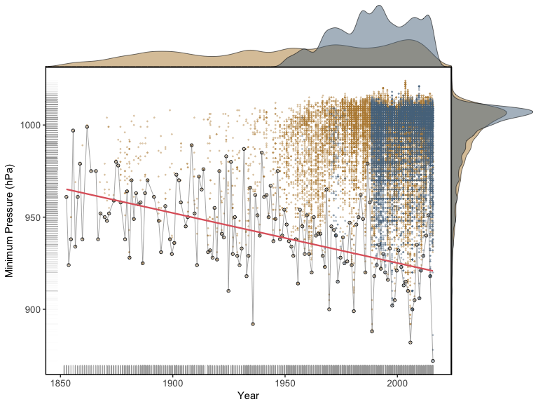

# Storm data analysis


## Loading the dataset


```r
# Entire workspace.
source_data("https://github.com/thomassie/Storms/blob/master/Data/StormDataWS.RData?raw=true")
```

```
## [1] ".Random.seed" "dd.pacific"   "i"            "dd"          
## [5] "n"            "dd.atlantic"  "dd.i"         "dd.org"
```


## Exploring the dataset

First, I generate two dataset that include a couple of summary statistics such as minimum pressure or maximum duration for each **storm**...

```r
# Some summary statistics to see which was the strongest storm etc.
dd.sum <- dd %>%
  group_by(ID) %>%
  summarise(Name = unique(Name),
            ID.plus = unique(ID.plus),
            Year = first(Year),
            Min.Pressure = min(Minimum.Pressure, na.rm = TRUE),
            Max.Duration = max(Duration, na.rm = TRUE),
            Mean.Strength.kph = round(mean(Maximum.Wind.kph, 0)),
            Max.Strength.kph = max(Maximum.Wind.kph, na.rm = TRUE),
            Storm.Start = format(DateTime.new[1], "%d/%m %H:%M:%S"),
            Storm.Stop = format(DateTime.new[length(DateTime.new)], "%d/%m %H:%M:%S")) %>%
  arrange(-desc(Year))
str(dd.sum)
```

```
## Classes 'tbl_df', 'tbl' and 'data.frame':	2845 obs. of  10 variables:
##  $ ID               : Factor w/ 2845 levels "AL011851","AL011852",..: 1 165 328 491 653 808 2 166 329 492 ...
##  $ Name             : chr  "UNNAMED" "UNNAMED" "UNNAMED" "UNNAMED" ...
##  $ ID.plus          : Factor w/ 2845 levels "ABBY (AL011968)",..: 1562 1688 1809 1926 2038 2145 1563 1689 1810 1927 ...
##  $ Year             : Factor w/ 165 levels "1851","1852",..: 1 1 1 1 1 1 2 2 2 2 ...
##  $ Min.Pressure     : num  Inf Inf Inf Inf Inf ...
##  $ Max.Duration     : num  3 0 0 11.75 3.75 ...
##  $ Mean.Strength.kph: num  98 129 80 105 80 85 118 93 108 117 ...
##  $ Max.Strength.kph : num  129 129 80 161 80 97 161 113 113 129 ...
##  $ Storm.Start      : chr  "25/06 00:00:00" "05/07 12:00:00" "10/07 12:00:00" "16/08 00:00:00" ...
##  $ Storm.Stop       : chr  "28/06 00:00:00" "05/07 12:00:00" "10/07 12:00:00" "27/08 18:00:00" ...
```

...and for each **year**. I will use teh latter dataset mainly for mapping (see blow).

```r
dd.sum.year <- dd %>%
  group_by(Year) %>%
  summarise(DateTime.new = first(DateTime.new),
            # Date = first(DateTime.new[which(Minimum.Pressure == min(Minimum.Pressure, na.rm = TRUE))]),
            Min.Pressure = min(Minimum.Pressure, na.rm = TRUE),
            Max.Duration = max(Duration, na.rm = TRUE),
            Mean.Strength.kph = round(mean(Maximum.Wind.kph, 0)),
            Max.Strength.kph = max(Maximum.Wind.kph, na.rm = TRUE),
            Items = length(Minimum.Pressure)) %>%
  arrange(-desc(Year))
```


But first, I have to assign the exact dates and times for these annual extreme values.

```r
# Get exact date and time for all extreme values!
p.min <- rep(NA, length(unique(dd$Year)))
d.max <- p.min
w.max <- p.min
for (i in 1:length(unique(dd$Year))) {
  p.min[i] = first(filter(dd, 
                          Year == unique(dd$Year)[i] & 
                            Minimum.Pressure == as.character(dd.sum.year$Min.Pressure[i]))$DateTime.new)
  d.max[i] = first(filter(dd, 
                          Year == unique(dd$Year)[i] & 
                            Duration == as.character(dd.sum.year$Max.Duration[i]))$DateTime.new)
  w.max[i] = first(filter(dd, 
                          Year == unique(dd$Year)[i] & 
                            Maximum.Wind.kph == as.character(dd.sum.year$Max.Strength.kph[i]))$DateTime.new)
}

dd.sum.year <- dd.sum.year %>%
  mutate(DateTime.p = as.POSIXct(p.min, origin = "1970-01-01")) %>%
  mutate(DateTime.d = as.POSIXct(d.max, origin = "1970-01-01")) %>%
  mutate(DateTime.w = as.POSIXct(w.max, origin = "1970-01-01"))

str(dd.sum.year)
```

```
## Classes 'tbl_df', 'tbl' and 'data.frame':	165 obs. of  10 variables:
##  $ Year             : Factor w/ 165 levels "1851","1852",..: 1 2 3 4 5 6 7 8 9 10 ...
##  $ DateTime.new     : POSIXct, format: "1851-06-25 00:00:00" "1852-08-19 00:00:00" ...
##  $ Min.Pressure     : num  Inf 961 924 938 997 ...
##  $ Max.Duration     : num  11.75 11 11.75 5.75 3.75 ...
##  $ Mean.Strength.kph: num  96 117 135 114 115 111 107 116 119 113 ...
##  $ Max.Strength.kph : num  161 161 209 177 177 209 145 145 177 177 ...
##  $ Items            : int  98 134 100 60 35 95 104 86 97 122 ...
##  $ DateTime.p       : POSIXct, format: NA "1852-08-26 06:00:00" ...
##  $ DateTime.d       : POSIXct, format: "1851-08-27 18:00:00" "1852-08-30 00:00:00" ...
##  $ DateTime.w       : POSIXct, format: "1851-08-23 00:00:00" "1852-08-24 00:00:00" ...
```


Then I introduce a couple of choices to get a nice ranking and to narrow the data down to a specific time period.

```r
# The first 'n.select' storms are selected for ranking
n.select <- 20
# Time window: from 'year.min' to 'year.max'. 
# Fill in identical years to get data only of year x.
year.min <- 2012
year.max <- 2015
```


But at first, we will have a glimpse at the rankings comming from the **entire** data.

```r
# Ranking according to...
# ...longest duration (enire data set).
topn.Duration       <- arrange(dd.sum, desc(dd.sum$Max.Duration))[1:n.select,] %>%
  mutate(criterion = "duration")
# Rearrange levels.
topn.Duration$ID.plus <- factor(topn.Duration$ID.plus, 
                                levels = topn.Duration$ID.plus[desc(topn.Duration$Max.Duration)])
# ...strongest wind speed recorded (entire data set)
topn.Strength.Max  <- arrange(dd.sum, desc(dd.sum$Max.Strength.kph))[1:n.select,] %>%
  mutate(criterion = "wind")
# Rearrange levels.
topn.Strength.Max$ID.plus <- factor(topn.Strength.Max$ID.plus, 
                                    levels = topn.Strength.Max$ID.plus[desc(topn.Strength.Max$Max.Strength.kph)])
# ...minimum pressure (entire data set)
topn.Pressure.Min  <- arrange(dd.sum, -desc(dd.sum$Min.Pressure))[1:n.select,] %>%
  mutate(criterion = "pressure")
# Rearrange levels.
topn.Pressure.Min$ID.plus <- factor(topn.Pressure.Min$ID.plus, 
                                    levels = topn.Pressure.Min$ID.plus[desc(topn.Pressure.Min$Min.Pressure)])
#dd.topn <- rbind(topn.Duration, topn.Strength.Max, topn.Pressure.Min)
```


I generate three barplots, one for each criterion...

```r
# Barplot for durations.
plot.dur <- topn.Duration %>%
  ggplot(aes(x = ID.plus,
             y = Max.Duration)) +
  # geom_bar(stat="identity") +
  geom_col(fill = "#A6A325") +
  # scale_x_discrete(limits = rev(levels(topn.Duration$ID.plus))) +
  # theme_bw() +
  theme_classic() +
  xlab("") +
  ylab("") +
  ggtitle("Maximum duration \n(days)") +
  theme(axis.text = element_text(size = 10),
        # axis.line = element_blank(),
        # axis.text.x = element_blank(),
        # axis.ticks.y = element_blank(),
        axis.text.x = element_text(angle = 0, hjust = 0.5, size = 12)) +
  geom_text(aes(label = Max.Duration),
            angle = 0,
            size = 3.5,
            color = "white",
            position = position_dodge(width = 0.1),
            hjust = 1.5,
            vjust = 0.5) +
  # theme(panel.border = element_rect(colour = "black", fill = NA, size = 1)) +
  # scale_y_continuous(expand = c(0.1,0)) +
  # geom_hline(yintercept = 0) +
  scale_y_continuous(expand = c(0,0)) +
  coord_flip() +
  scale_x_discrete(limits = rev(levels(topn.Duration$ID.plus)))

# Barplot for wind speed.
plot.wind <- topn.Strength.Max %>%
  ggplot(aes(x = ID.plus,
             y = Max.Strength.kph)) +
  geom_col(fill = "#22668C") +
  theme_classic() +
  xlab("") +
  ylab("") +
  ggtitle("Maximum wind speed \n(km per hour)") +
  theme(axis.text = element_text(size = 10),
        axis.text.x = element_text(angle = 0, hjust = 0.5, size = 12)) +
  geom_text(aes(label = Max.Strength.kph),
            angle = 0,
            size = 3.5,
            color = "white",
            position = position_dodge(width = 0.1),
            hjust = 1.5,
            vjust = 0.5) +
  scale_y_continuous(expand = c(0,0)) +
  coord_flip() +
  scale_x_discrete(limits = rev(levels(topn.Strength.Max$ID.plus)))

# Barplot for wind speed.
plot.pres <- topn.Pressure.Min %>%
  ggplot(aes(x = ID.plus,
             y = Min.Pressure)) +
  geom_col(fill = "#DF636A") +
  theme_classic() +
  xlab("") +
  ylab("") +
  ggtitle("Minimum pressure \n(hPa)") +
  theme(axis.text = element_text(size = 10),
        axis.text.x = element_text(angle = 0, hjust = 0.5, size = 12)) +
  geom_text(aes(label = Min.Pressure),
            angle = 0,
            size = 3.5,
            color = "white",
            position = position_dodge(width = 0.1),
            hjust = 1.5,
            vjust = 0.5) +
  scale_y_continuous(expand = c(0,0)) +
  coord_cartesian(ylim = c(800, max(topn.Pressure.Min$Min.Pressure))) +
  scale_x_discrete(limits = rev(levels(topn.Pressure.Min$ID.plus))) +
  coord_flip() 
```


...which are ten put together in a single figure. We can now have a look at the 20 storms that lasted the longest (**A**), showed the highest maximum wind speed (**B**), and the lowest minimum pressure (**C**). (I know that one can argue about cuttig the scale here. However, no storm will ever reach 0 hPa, and therefore, I introduced this 'baseline'.)  

```r
plot_grid(plot.dur, plot.wind, plot.pres + remove("x.text"), 
          labels = c("A", "B", "C"),
          ncol = 3, nrow = 1)
```

<!-- -->

Rankings are a nice way to get an idea about the top of the pops. However, a lot of data is neglected and, hence, one misses a lot of information, too. Here is another way of visualising the storm data: each point represents a measure of minimum pressure (in hPa or mbar).

```r
# A bar chart counting observations.
plot.pressure.bar.x <- dd.sum.year %>%
  ggplot(aes(x = as.numeric(as.character(Year)),
             y = Items)) +
  geom_histogram(fill = "#DF636A",
                 stat = "identity",
                 width = 1) +
  clean_theme() + 
  rremove("legend")

# To draw several vertical lines in ggplot.
dd.lines <- data.frame(int = c(as.POSIXct(0, origin = "1951-01-01"),
                               as.POSIXct(0, origin = "1967-01-01")),
                       year = c(1950, 1967))

# Main plot.
plot.pressure.main <- ggplot(data = dd,
                             aes(x = DateTime.new,
                                 y = Minimum.Pressure)) +
  # geom_vline(aes(xintercept = int), 
  #            style = 2,
  #            data = dd.lines,
  #            size = 0.3) +
  # stat_density_2d(geom = "raster", 
  #                 aes(fill = ..density..), 
  #                 contour = FALSE,
  #                 alpha = 0.9,
  #                 show.legend = FALSE) +
  # scale_fill_gradientn(colours = rev( brewer.pal( 9, "Blues" ))) +
  geom_point(aes(colour = Ocean),
             alpha = 0.3,
             size = 0.3) +
  # colour = "#FBFBFA") +
  # colour = "#999999") +
  # ggpubr::color_palette("jco") +
  # geom_smooth(method = "lm",
  #             se = FALSE,
  #             span = 0.2,
  #             colour = "#F93A2E",
  #             alpha = 0.9,
  #             size = 1.2) +
  geom_smooth(data = dd.sum.year,
              # geom_smooth(data = filter(dd.sum.year, year.min <= year(dd.sum.year$DateTime.p) & year(dd.sum.year$DateTime.p) <= year.max),
              aes(x = DateTime.p,
                  y = Min.Pressure),
              method = "lm",
              se = FALSE,
              span = 0.2,
              # linetype = "dashed",
              colour = "#DF636A",
              alpha = 0.9,
              size = 0.8) +
  geom_point(data = dd.sum.year,
             # geom_point(data = filter(dd.sum.year, year.min <= year(dd.sum.year$DateTime.p) & year(dd.sum.year$DateTime.p) <= year.max),
             aes(x = DateTime.p,
                 y = Min.Pressure),
             shape = 1,
             size = 1.2,
             stroke = 0.5,
             colour = "#333333") +
  geom_line(data = dd.sum.year,
            aes(x = (DateTime.p),
                y = Min.Pressure),
            size = 0.3,
            alpha = 0.9,
            colour = "#333333") +
  theme_bw() +
  geom_rug(alpha = 0.02,
           colour = "#999999") +
  theme(panel.border = element_rect(colour = "black", fill = NA, size = 1),
        panel.grid.major = element_blank(), 
        panel.grid.minor = element_blank(),
        axis.text = element_text(size = 10)) +
  # geom_text(data = dd.lines, aes(label = year(int), x = int, y = -Inf), angle = 0, inherit.aes = F, hjust = -0.2, vjust = -36, size = 3.5) +
  labs(x = "Year", 
       y = "Minimum Pressure (hPa)") + 
  # ggpubr::color_palette("jco") +
  scale_colour_manual(values = c("#B78A3F", "#58758C")) +
  rremove("legend")
# title = paste("Minimum pressure recorded for years", year.min, "to", year.max))
# ggtitle(paste("Minimum pressure recorded for years", year.min, "to", year.max))

# A density plot on top of the main plot.
# TREAT the date.time AS NUMERIC!!!
plot.pressure.dens.x <- axis_canvas(plot.pressure.main, axis = "x") + 
  geom_density(data = dd, aes(x = as.numeric(DateTime.new), fill = Ocean),
               alpha = 0.5, size = 0.2) +
  # ggpubr::color_palette("jco")
  scale_fill_manual(values = c("#B78A3F", "#58758C"))
# ...and one on the right site.
plot.pressure.dens.y <- axis_canvas(plot.pressure.main, axis = "y", coord_flip = TRUE) +
  geom_density(data = dd, aes(x = as.numeric(Minimum.Pressure), fill = Ocean),
               alpha = 0.5, size = 0.2) +
  # ggpubr::color_palette("jco") +
  scale_fill_manual(values = c("#B78A3F", "#58758C")) +
  coord_flip()
```

Now, one can combine all three plots to a single figure.

```r
plot.pressure.1 <- insert_xaxis_grob(plot.pressure.main, plot.pressure.dens.x, grid::unit(0.2, "null"), 
                                     position = "top")
plot.pressure.2 <- insert_yaxis_grob(plot.pressure.1, plot.pressure.dens.y, grid::unit(.2, "null"), 
                                     position = "right")
ggdraw(plot.pressure.2)
```

<!-- -->

One can see here a couple of things, of which some are described in the datset info provided [here](http://www.aoml.noaa.gov/hrd/hurdat/newhurdat-format.pdf):

* Until the 1950s, there are only sporadic measurements which means that we do not have much information about the storms from the time before. This makes the comparison with the rest of the data a bit dodgy.
* And again, the number of measurements increased after in the late 1960s (I marked the year 1967). 


Now I select specific parts of the prepared dataset according to the choices I made above.


Let's have a look at these storms. First, I want to see which are the storms that lasted the longest. (I use a dataset called 'dd.s' indicating a selection of the entire summary data set 'dd.sum'.)


